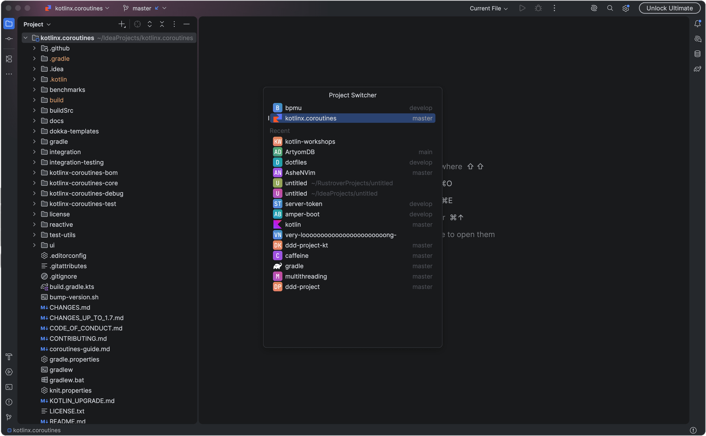
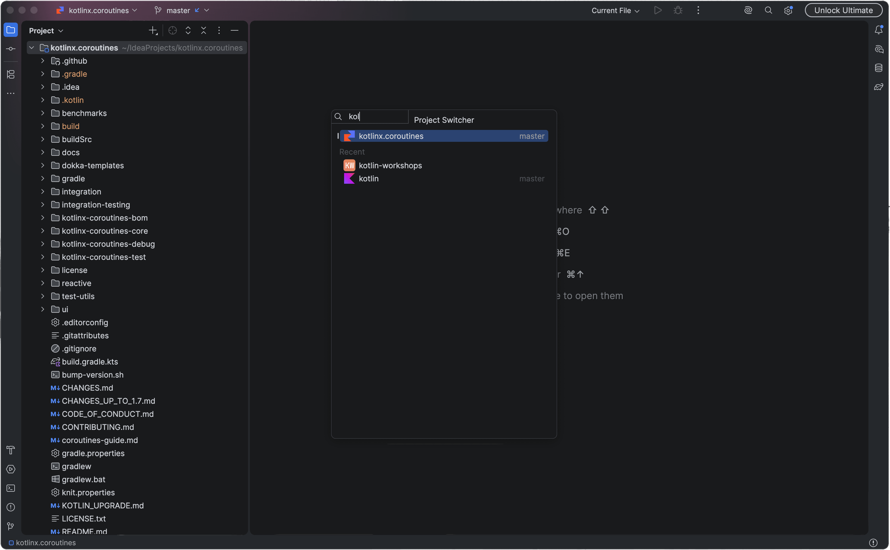

  

<h1 align="center">Project Switcher</h1>

  Use the keyboard to move between your open and recent IntelliJ Platform projects.

---

Project Switcher brings your open and recent projects into one popup in IntelliJ Platform IDEs.

To return to your previous project, press <kbd>Alt</kbd>+<kbd>F2</kbd>, then <kbd>Enter</kbd>. The popup selects it
for you and orders open projects by their last use, newest first.

Looking for another project? Start typing its name or location. Search handles common typos and can correct the
keyboard layout. Choosing an open project brings its window into focus immediately. For recent projects, the IDE's
**Open project in** setting determines where they open.

## Screenshots

## Shortcuts

| Key                                                     | Action                                                  |
|---------------------------------------------------------|---------------------------------------------------------|
| <kbd>Alt</kbd>+<kbd>F2</kbd>                            | Open or close Project Switcher                          |
| Type                                                    | Search project names and locations                      |
| <kbd>Up</kbd> / <kbd>Down</kbd>                         | Select the previous or next row                         |
| <kbd>Page Up</kbd> / <kbd>Page Down</kbd>               | Go back or forward one page                             |
| <kbd>Home</kbd> / <kbd>End</kbd>                        | Jump to the first or last project                       |
| <kbd>Enter</kbd> or click                               | Open the selection according to the IDE setting         |
| <kbd>Shift</kbd>+<kbd>Enter</kbd> or <kbd>Shift</kbd>+click | Open a recent project in the current window         |
| <kbd>Ctrl</kbd>+<kbd>Enter</kbd> or <kbd>Ctrl</kbd>+click   | Open a recent project in a new window               |
| <kbd>Cmd</kbd>/<kbd>Ctrl</kbd>+<kbd>W</kbd>             | Close an open project or remove a recent entry; <kbd>Delete</kbd> is an option in [Settings](#settings) |
| <kbd>Esc</kbd>                                          | Clear the query; with no query, dismiss the popup        |

Only recent projects use the current-window and new-window modifiers. An open project always receives focus in its
existing window. If you close the current project, focus returns to the one you used before it.

## Settings

Configure the popup in **Settings | Tools | Project Switcher**:

- **Show a search field above the list** replaces the title with a search input. When disabled, typing brings up
  speed search in the upper-left corner, like in Recent Files.
- **Show the location of the selected project at the bottom** displays its path below the project list.
- **Show the shortcuts for the selected project at the bottom** displays the keys available for that project.
- **Close or remove projects with** lets you choose between <kbd>Cmd</kbd>/<kbd>Ctrl</kbd>+<kbd>W</kbd> and
  <kbd>Delete</kbd>/<kbd>Backspace</kbd> for closing open projects or removing recent entries. Delete and Backspace
  require an empty search. If you use them to erase a query, you must move the selection before they can close a
  project. Holding either key down closes just one project.

## Change the Shortcut

Find **Switch Project** in **Settings | Keymap** to assign your own shortcut. You can also run it from
**Tools | Switch Project**.

## Requirements

- An IntelliJ Platform IDE on the 2026.2 branch, including IntelliJ IDEA, PyCharm, WebStorm, GoLand and Rider.
  Only platform-level modules are required, so other IDEs on that branch are supported too.

## License

[Apache License 2.0](LICENSE)
